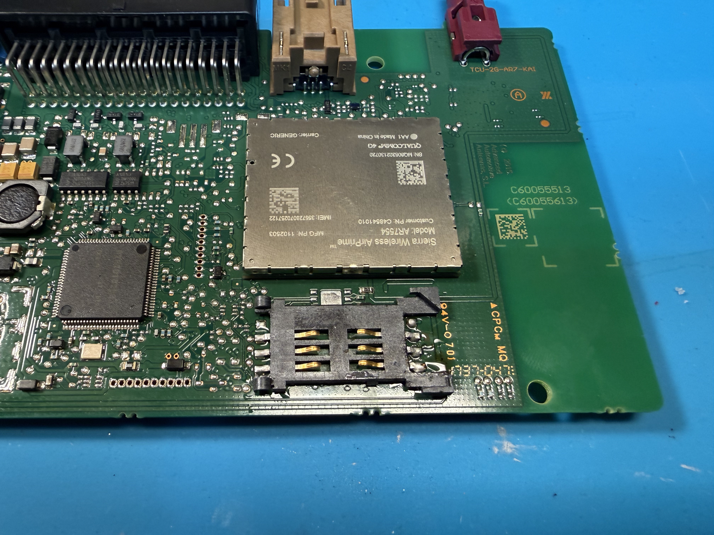
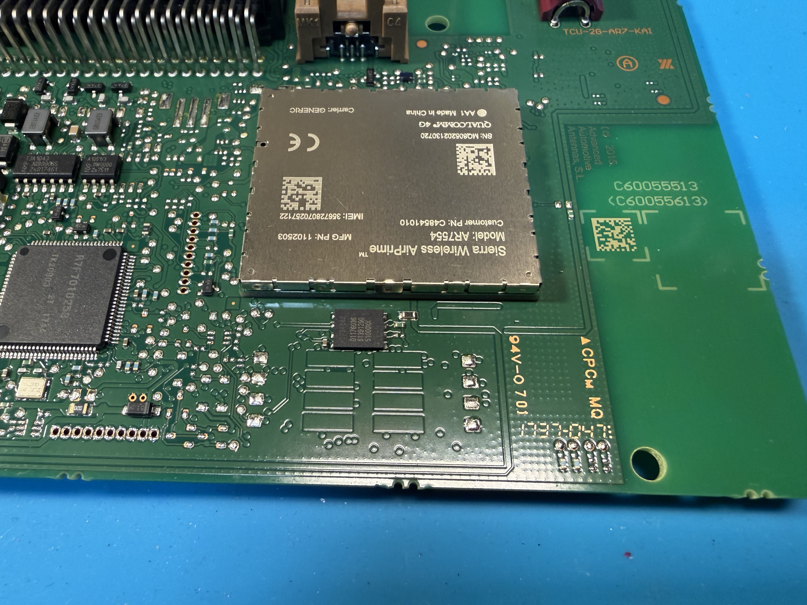
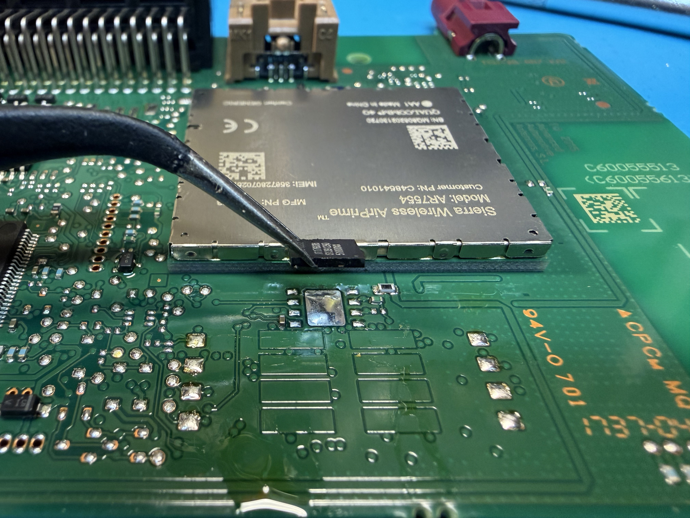
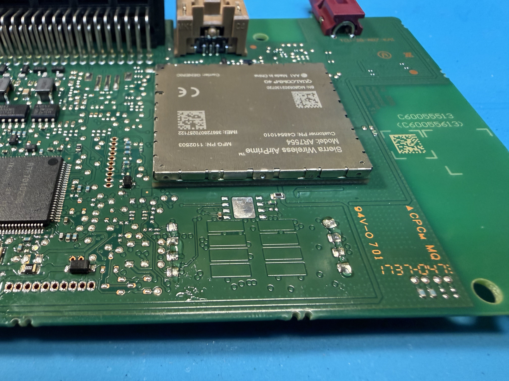
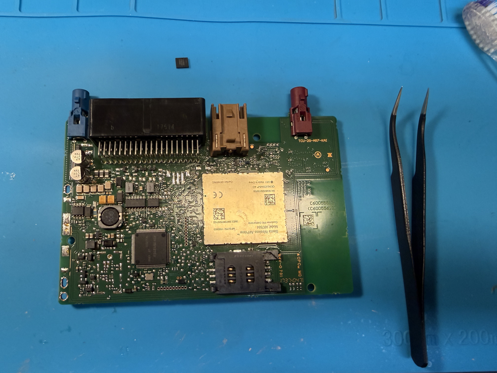
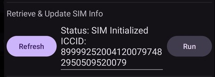

import { Steps, Aside, Badge } from '@astrojs/starlight/components';

<Aside type="note" title="Which cars is this for?">
  This guide covers the **40 kWh 2018–2022 MY e-NV200** and **ZE1 40 kWh 2018–20 MY**.
</Aside>

<Aside type="tip" icon="question" title="Don't have the tools or the skill?">
  Starting from 39 €, our repair partners offer a ready-to-go repair for LEAF TCUs at an affordable price, with a 3-year warranty. Each TCU is repaired, tested and verified before dispatch, and you don't need to follow this guide.

  - [viaaq workshop](https://shop.viaaq.eu/product/nissan-leaf-tcu-repair-sim-holder-installation-sim-plan-and-configuration/) (mail-in repair and repaired TCUs in stock)
</Aside>

**Difficulty:** <Badge text="Difficult" variant="danger" size="medium" />

## Step 1: Obtain a SIM card (or two)

The TCU needs a SIM card for cellular connectivity.

- **Recommended provider:** a SIM from [viaaq mobile](https://mobile.viaaq.eu/). It integrates with OpenCARWINGS out of the box, has an affordable data plan and supports Binary SMS.
- **SIM type:** a standard Mini SIM (2FF), or a SIM that works with an adapter.
- **Data plan:** at least 1–5 MB per month without a navigation unit, or 5–10 MB per month with one (the navigation unit periodically updates nearby charging stations).
- **Alternative providers:** if viaaq mobile isn't available or doesn't suit you, use a provider with affordable data and SMS support (for example AT&T or T-Mobile prepaid SIMs). You will then need a way to send Binary SMS over the internet, such as Seven.io, gatewaysms, the OpenCARWINGS SMS gateway, a similar service, or your own webhook-based setup.
- **Why a second SIM may be necessary:** sending SMS may require a second SIM, usually used in a USB modem (see the SMS gateway below).

<Aside type="caution" title="Important requirement">
  The SIM in the TCU must be able to receive **Binary SMS (no UDH)**. Not all SMS providers support binary SMS, and messages sent from abroad are sometimes marked as spam. Be prepared to use the [OpenCARWINGS SMS Gateway](https://github.com/developerfromjokela/opencarwings-sms) with a modem in case your provider blocks incoming SMS from online SMS gateways.
</Aside>

## Step 2: Access the TCU

On RHD cars the TCU sits behind the glovebox, and the physical location is the same on LHD cars.

### Tools and preparation

- **Tools:** Phillips screwdriver, plastic trim removal tool (to avoid scratches), flashlight.
- **Preparation:** turn off the vehicle and remove the key to avoid electrical issues.

### Remove the glovebox

<Steps>

1. Open the glovebox and empty it.

2. Locate and remove the screws (usually 2–4) along the edges or inside the glovebox.

3. Gently pull the glovebox forward. It may be held by clips, so use the trim tool to pry it loose if needed.

4. Disconnect any wiring (for example the glovebox light) by pressing the connector tabs and pulling.

</Steps>

### Locate the TCU

Behind the glovebox you will see a rectangular metal or plastic unit, about the size of a small book, with wiring harnesses and an antenna connection. That is the TCU.

### Video guide

This video shows the disassembly step by step (**1:50 – 7:50**):

  <iframe
    style={{ width: '100%', height: '100%', border: 0, borderRadius: '0.5rem' }}
    src="https://www.youtube.com/embed/wHmqdXGBdrg?start=109"
    title="Video guide: removing the glovebox and TCU on a Nissan LEAF"
    allow="accelerometer; autoplay; clipboard-write; encrypted-media; gyroscope; picture-in-picture; web-share"
    allowFullScreen
  ></iframe>

<Aside type="caution">
  Work carefully to avoid damaging clips or wiring. Take photos of the setup before you start, for reference.
</Aside>

## Step 3: Disassemble the TCU, desolder the eUICC chip and solder a SIM slot

The TCU is easy to open. It is held together by a few plastic clips accessible from the outside.

**Tools required:** microsoldering station (heat gun), soldering iron, SIM card holder and, ideally, flux.

Some example parts:

- [Amphenol C707 10M006 049 2A (Mouser)](https://ro.mouser.com/ProductDetail/Amphenol-MCP/C707-10M006-049-2A)
- [GCT SIM5060-6-0-26-00-A (TME)](https://www.tme.eu/en/details/sim5060-6-0-26-00a/card-connectors/gct/sim5060-6-0-26-00-a/)

### 1: Remove the old eUICC SIM
Use a microsoldering station or heat gun to remove the old eUICC. A temperature of around **380–410 °C** removes the chip quickly and effectively.

<Aside type="caution">
  Be careful not to unsolder nearby components by accident.
</Aside>

### 2: Solder the new SIM slot

Apply flux to the contacts if you have it, then solder the slot on in the orientation shown above (4G version). **For 3G the orientation is different.** Afterwards, clean off the flux, for example with isopropyl alcohol.

<Aside type="caution" title="Be careful">
  The slot may not lie flat on the PCB, and that's okay. There may be small components such as resistors underneath it. They are small enough not to interfere much with the slot, but they are easy to knock off the board by accident, which can cause problems with the SIM.
</Aside>

### 3: Confirm operation

When you're done, you can easily test whether the SIM card works. Plug the SIM back into the car and watch the car icon on the navigation system:

If the car icon is crossed out, the TCU isn't getting cell reception. Possible causes are poor signal, a SIM card registration issue, or the SIM card not being detected.

Another way to check for SIM functionality, run "Retrieve & Update SIM Information".

<Aside type="note">
  The SIM ID (ICCID) will not update automatically on the navigation unit (NissanConnect settings, ID Information screen). Use "Retrieve & Update SIM Information" routine in TCU Configurator app, which will make the TCU update ICCID/SIM ID.
</Aside>

## Step 4: Program the settings

The Access Point Name (APN) and server information must be configured so the TCU can connect to the cellular network. You do this with an Android app.

<Steps>

1. **Download the app.** Get the TCU Configurator from GitHub: [tcu-configurator-xx.apk](https://github.com/developerfromjokela/nissan-leaf-tcu/releases/latest).

2. **Install the app.**
   - Transfer the `.apk` file to your Android device (USB, email, etc.).
   - Enable "Install from unknown sources" in Settings > Security.
   - Open the file and install the app.

3. **Connect to the TCU.** Power the vehicle on to **ACC mode** (important), then use the app to connect to the TCU via Bluetooth OBD.

4. **Set only the TSP APN fields.**
   - Open the app and find the TSP APN settings.
   - Enter your SIM provider's APN into the fields named **TSP APN Name**, **TSP APN Username**, **TSP APN Password**. **Leave the other APN fields as they are.** For example, almost all Finnish operators use `internet`, viaaq mobile shows the APN in the subscription details, and other providers list it on their website.
   - Save and apply the settings.

5. **Set the server information.**
   - Enter the server details in the TCU Configurator app:

     | Field | Value |
     | --- | --- |
     | OBS URL | `http://biz-tcu.viaaq.eu` |
     | OBS Port | `80` |

   - Save and apply the settings.

</Steps>

<Aside type="note">
  Make sure Bluetooth is enabled on your Android device and the car is in ACC mode during configuration.
</Aside>

<Aside type="tip">
  If you have trouble writing the TCU configuration, try to press write a few times in a row. On some chinese OBD adapters, settings don't successfully write on the first time.
</Aside>

## Step 5: Complete the setup on the website

Finish the TCU setup in the web portal: sign in to OpenCARWINGS and follow the **Add Car** process.

## Step 6: Configure your preferred SMS provider

Finalize the TCU activation by setting up an SMS provider in the OpenCARWINGS settings.

- **SMS providers:** the providers shown in settings are limited to those capable of sending Binary SMS.
- **Set Up OpenCARWINGS SMS Gateway (if using a modem):** set up a Raspberry Pi, computer or server as a relay. The latest releases are at [developerfromjokela/opencarwings-sms](https://github.com/developerfromjokela/opencarwings-sms). Android is not supported.
- **Verify:** do a data refresh to confirm the TCU is receiving SMS.

<Aside type="caution" title="If refresh commands do nothing">
  In some cases Nissan has remotely disabled TCU services, and sending refresh commands won't have any effect. Send the **Service Provisioning** configuration command from the **TCU Configuration** tab with all services set to **Active**, then try the refresh command again.
</Aside>

<Aside type="caution">
  Clear all DTC codes before trying to send SMS. Active DTC codes may put the TCU into fault mode, causing it to refuse any commands.
</Aside>

<Aside type="tip" title="Congratulations!">
  If all steps completed successfully, your TCU is back online and telematics functionality is restored. The next step is [programming the APN settings for the navigation unit](../../navigation-single-sd/).
</Aside>