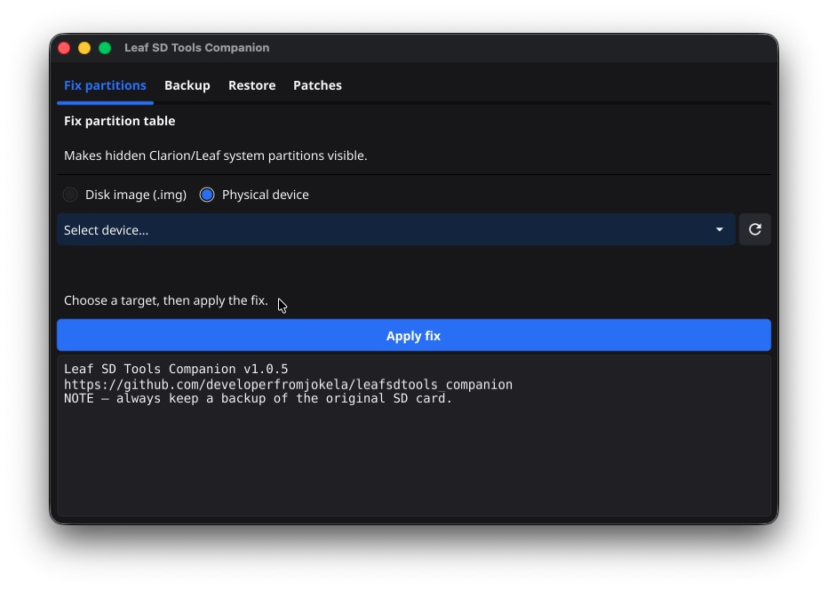
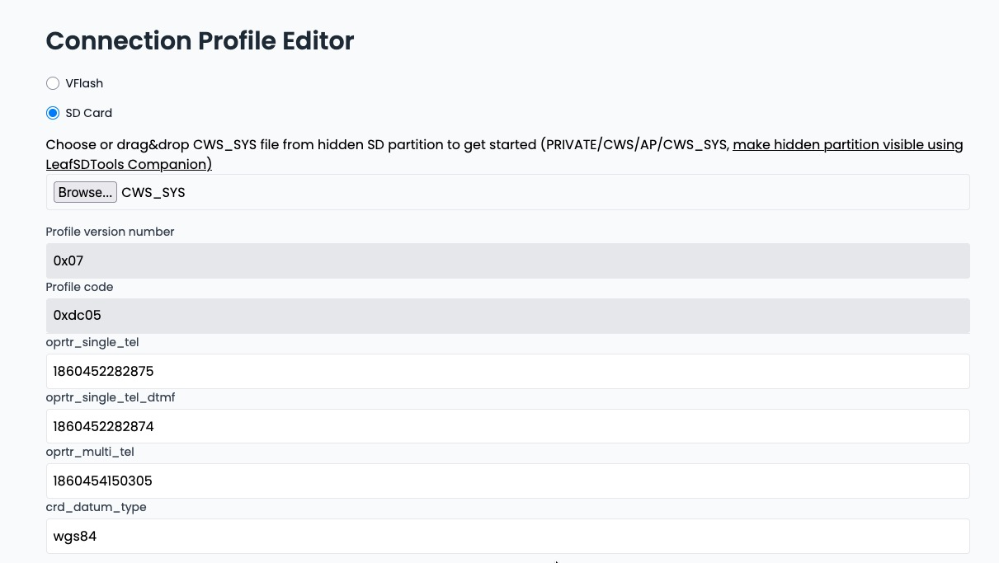
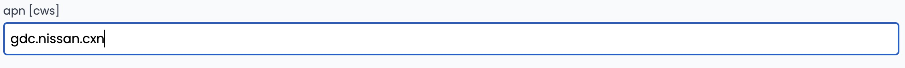
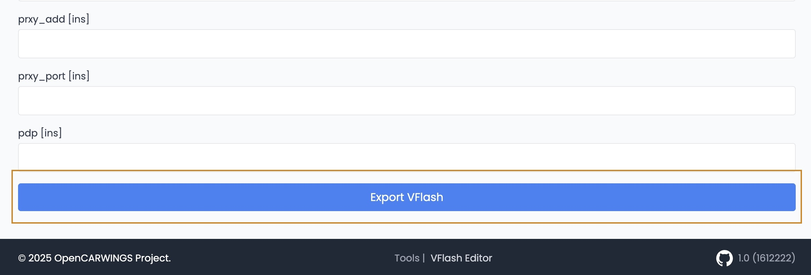
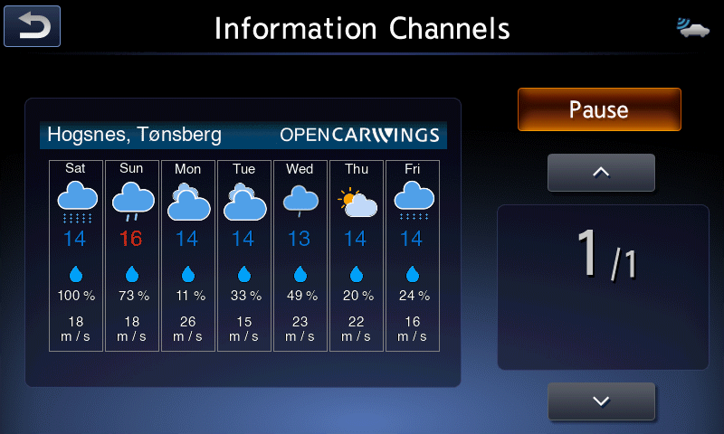

import { Steps, Aside } from '@astrojs/starlight/components';

<Aside type="caution" title="Csak egy SD-foglalatos fejegységhez">
  Ez az útmutató kizárólag az **egy SD-foglalattal** rendelkező navigációs fejegységekhez készült. Ha a fejegységen két SD-foglalat van, a másik útmutatót kövesd.
</Aside>

Ez az útmutató bemutatja, hogyan módosíthatod a fejegység APN-beállítását és szervercímét, hogy ismét elérhesse az OpenCARWINGS rendszert. Az eljárás a **2016–2019-es, 30 vagy 40 kWh-s AZE0 és ZE1** modellekre vonatkozik. Minden lépést körültekintően hajts végre.

<Aside type="note" title="A forrásoldalak hatóköre eltér">
  A kapcsolódó TCU-útmutató 2016–2017-es, 24/30 kWh-s AZE0 modelleket, ez a fejegység-útmutató viszont 2016–2019-es, 30/40 kWh-s AZE0 és ZE1 modelleket nevez meg. A 24 kWh-s modellre ebből nem következik automatikusan a kompatibilitás. Mielőtt folytatod, a fejegység kivitele és az SD-foglalatok száma alapján ellenőrizd, hogy valóban ez az eljárás vonatkozik-e az autódra.
</Aside>

<div style={{ aspectRatio: '16 / 9', marginBlock: '1.5rem' }}>
  <iframe
    style={{ width: '100%', height: '100%', border: 0, borderRadius: '0.5rem' }}
    src="https://www.youtube.com/embed/0qPf6kGowmM"
    title="Videós útmutató: a navigációs fejegység ismételt hálózatra kapcsolása"
    allow="accelerometer; autoplay; clipboard-write; encrypted-media; gyroscope; picture-in-picture; web-share"
    referrerPolicy="strict-origin-when-cross-origin"
    allowFullScreen
  ></iframe>
</div>

## 1. lépés: Készíts biztonsági mentést vagy klónt az SD-kártyáról

Készíts biztonsági mentést a navigáció SD-kártyájáról. Lehetőleg klónt is készíts egy másik SD-kártyára, hogy az eredeti meghibásodása esetén legyen használható másolatod. A klónhoz új SD-kártyára van szükség, amelyet ezután a fejegységben használhatsz.

<Aside type="danger" title="Őrizd meg az eredeti SD-kártyát">
  Legalább teljes biztonsági mentést készíts az eredeti SD-kártyáról. A legbiztonságosabb megoldás az, ha a módosítást egy ellenőrzötten működő klónon végzed, az eredetit pedig változatlanul megőrzöd. Módosítás előtt ellenőrizd, hogy a fejegység a klónnal is elindul.
</Aside>

<Steps>

1. Töltsd le a [LeafSDTools Companion](https://github.com/developerfromjokela/leafsdtools_companion/releases/) alkalmazást.

2. A LeafSDTools Companion segítségével készíts biztonsági mentést az eredeti SD-kártyáról.

3. *(Csak klón készítésekor)* Állítsd vissza a mentést az új SD-kártyára.

4. Jelöld ki az SD-kártyát a LeafSDTools Companion alkalmazásban, nyisd meg a **Fix partition** lapot, kattints az **Apply Fix** gombra, majd várd meg a művelet befejezését.

5. A javítás után egynél több partíciónak kell megjelennie.

   

</Steps>

## 2. lépés: Módosítsd a navigációs fejegység beállításait

Miután az SD-kártyát csatlakoztattad a számítógéphez, az egyik partíción megtalálható a `PRIVATE/CWS/AP/CWS_SYS` fájl.

<Steps>

1. Másold ki a `CWS_SYS` fájlt az SD-kártyáról egy másik helyre, például az Asztal vagy a Dokumentumok mappába.

2. Nyisd meg böngészőben a [https://opencarwings.viaaq.eu/navi](https://opencarwings.viaaq.eu/navi) oldalt.

3. Válaszd az **SD Card** lehetőséget, majd tallózd be a `CWS_SYS` fájlt. A mezőknek ki kell töltődniük, és meg kell jelennie a **Connection Profile 1** profilnak. Ha ez nem történik meg, lépj kapcsolatba a fejlesztővel.

   

4. Nevezd el a kapcsolati profilt a mobilszolgáltatód alapján.

   

5. Írd át az APN nevét az `apn [cws]` mezőben. A SIM-szolgáltatótól függően szükség lehet az APN-felhasználónév és -jelszó módosítására is a `usr [cws]` és `psswrd [cws]` mezőkben.

   
   
   

6. Módosítsd a szerver URL-jét a `url [cws]` mezőben.

   ```text title="Szerver URL"
   Eredeti: http://biz.nissan-gev.com/WARCondelivbas/it-m_gw10/
   Új:      http://biz.viaaq.eu/WARCondelivbas/it-m_gw10/
   ```

   Eredeti:

   ![Az eredeti Nissan URL az url [cws] mezőben](../../../../../assets/navi-single-sd/img15.jpg)

   Módosítva:

   ![A módosított URL az url [cws] mezőben](../../../../../assets/navi-single-sd/img16.jpg)

7. Görgess az oldal aljára, és kattints az **Export** gombra. Ekkor letöltődik egy új beállításfájl. Másold az SD-kártyára a `/PRIVATE/CWS/AP/CWS_SYS` helyre, és erősítsd meg a felülírást, ha a rendszer rákérdez.

   

</Steps>

<Aside type="caution">
  Az új beállításfájl nevének és elérési útjának pontosan meg kell egyeznie az eredetivel: `/PRIVATE/CWS/AP/CWS_SYS`.
</Aside>

## 3. lépés: Próbáld ki a NissanConnect-szolgáltatásokat

Helyezd vissza az SD-kártyát a navigációs fejegységbe, majd ellenőrizd, hogy elérhető-e valamelyik adatcsatorna.



<Aside type="tip" title="Gratulálunk!">
  Ha minden lépés sikerült, a navigációs fejegység ismét eléri a hálózati szolgáltatásokat. Ismét működhet például a célpont autóba küldése, a telemetria és több más funkció. A tényleges működést funkciónként ellenőrizd az autóban.
</Aside>
