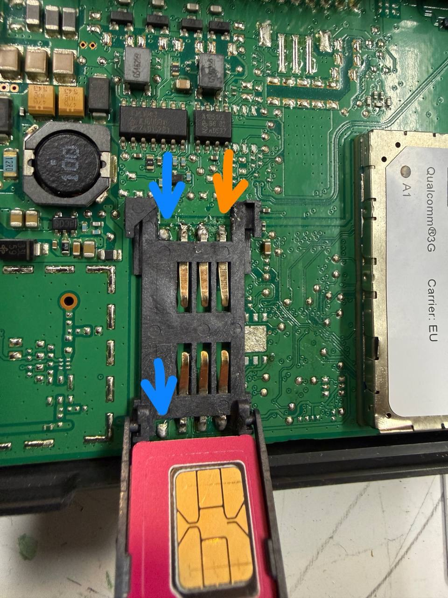

import { Steps, Aside, Badge } from '@astrojs/starlight/components';

<Aside type="note" title="Mely autókhoz használható ez az útmutató?">
  Ez az útmutató a **2016–2017-es modellévű, 24 vagy 30 kWh-s LEAF AZE0** modellekhez készült. A 2016 előtti ZE0 és AZE0 modellekhez [ezt az útmutatót](../../leaf-ze0aze0e-nv200-2011-2016/tcu/) használd.
</Aside>

<Aside type="tip" icon="question" title="Nincs megfelelő eszközöd vagy gyakorlatod?">
  Az eredeti OpenCARWINGS útmutató szerint a javítópartnerek 39 eurótól vállalnak használatra kész TCU-javítást, hároméves garanciával. Minden TCU-t javítanak, tesztelnek és ellenőriznek a visszaküldés előtt, így ezt az útmutatót nem kell saját kezűleg végrehajtanod. Az aktuális árat, a szolgáltatás tartalmát és a garancia feltételeit mindig ellenőrizd a műhely oldalán.

  - [viaaq műhely](https://shop.viaaq.eu/product/nissan-leaf-tcu-repair-sim-holder-installation-sim-plan-and-configuration/) (beküldéses javítás és készleten lévő javított TCU-k)
</Aside>

**Nehézségi szint:** <Badge text="Nehéz" variant="danger" size="medium" />

## 1. lépés: Szerezz be egy (vagy két) SIM-kártyát

A TCU-nak SIM-kártyára van szüksége a mobilhálózati kapcsolathoz.

- **Ajánlott szolgáltató:** [viaaq mobile](https://mobile.viaaq.eu/) SIM-kártya. Alapból együttműködik az OpenCARWINGS rendszerrel, kedvező adatcsomagot kínál, és támogatja a bináris SMS-eket.
- **SIM típusa:** szabványos Mini SIM (2FF), vagy adapterrel használható SIM-kártya.
- **Adatcsomag:** fejegység nélkül legalább havi 1–5 MB, fejegységgel 5–10 MB. A fejegység időnként frissíti a közeli töltőállomásokat.
- **Más szolgáltatók:** ha a viaaq mobile nem érhető el vagy nem megfelelő, olyan szolgáltatót válassz, amely kedvező adatforgalmat és SMS-fogadást biztosít (például AT&T vagy T-Mobile feltöltőkártya). Ebben az esetben az interneten keresztül kell bináris SMS-t küldened, például Seven.io, gatewaysms, az OpenCARWINGS SMS Gateway, hasonló szolgáltatás vagy saját webhook-alapú megoldás segítségével.
- **Miért lehet szükség második SIM-re?** Az SMS-küldéshez külön SIM-kártya kellhet, amelyet általában USB-modemben használnak. Erről az SMS Gateway résznél olvashatsz.

<Aside type="caution" title="Fontos követelmény">
  A TCU-ban lévő SIM-kártyának képesnek kell lennie **UDH nélküli bináris SMS** fogadására. Nem minden SMS-szolgáltató támogatja a bináris SMS-t, a külföldről érkező üzeneteket pedig néha kéretlen üzenetként szűrik. Ha az online SMS-átjáróról érkező üzeneteket a szolgáltató blokkolja, szükség lehet az [OpenCARWINGS SMS Gateway](https://github.com/developerfromjokela/opencarwings-sms) és egy modem használatára.
</Aside>

## 2. lépés: Férj hozzá a TCU-hoz

Jobbkormányos autóban a TCU a kesztyűtartó mögött található. Balkormányos autóban is ugyanott helyezkedik el.

### Szükséges eszközök és előkészületek

- **Eszközök:** csillagcsavarhúzó, műanyag kárpitbontó szerszám a karcolások elkerüléséhez, valamint zseblámpa.
- **Előkészület:** az elektromos problémák elkerülése érdekében kapcsold ki az autót, és vedd ki vagy távolítsd el a kulcsot.

### A kesztyűtartó eltávolítása

<Steps>

1. Nyisd ki és ürítsd ki a kesztyűtartót.

2. Keresd meg és távolítsd el a széleinél vagy a belsejében lévő csavarokat (általában 2–4 darabot).

3. Óvatosan húzd előre a kesztyűtartót. Patentek is tarthatják, ezért szükség esetén műanyag kárpitbontóval lazítsd meg.

4. A csatlakozók rögzítőfülének benyomásával válaszd le az esetleges vezetékeket, például a kesztyűtartó világítását.

</Steps>

### A TCU megkeresése

A kesztyűtartó mögött egy kisebb könyv méretéhez hasonló, téglalap alakú fém- vagy műanyag egységet találsz, kábelkötegekkel és antennacsatlakozóval. Ez a TCU, vagyis a telematikai vezérlőegység.

### Videós útmutató

Az alábbi videó **1:50 és 7:50 között** lépésről lépésre bemutatja a szétszerelést:

  <iframe
    style={{ width: '100%', height: '100%', border: 0, borderRadius: '0.5rem' }}
    src="https://www.youtube.com/embed/wHmqdXGBdrg?start=109"
    title="Videós útmutató: a kesztyűtartó és a TCU eltávolítása Nissan LEAF-ből"
    allow="accelerometer; autoplay; clipboard-write; encrypted-media; gyroscope; picture-in-picture; web-share"
    allowFullScreen
  ></iframe>

<Aside type="caution">
  Dolgozz óvatosan, nehogy megsértsd a patenteket vagy a vezetékeket. Mielőtt hozzányúlsz, készíts fényképeket az eredeti állapotról.
</Aside>

## 3. lépés: Szereld szét a TCU-t, forraszd ki az eUICC-t, és építs be SIM-foglalatot

A TCU könnyen felnyitható. A házat kívülről hozzáférhető műanyag patentek tartják össze.

**Szükséges eszközök:** mikroforrasztó állomás (hőlégfúvó), forrasztópáka, SIM-foglalat és lehetőség szerint folyasztószer (flux).

<Aside type="danger" title="Szakembert igénylő beavatkozás">
  Ez finom elektronikai alkatrészeken végzett mikroforrasztás. Hibás végrehajtása véglegesen károsíthatja a TCU-t. A megadott hőmérséklet és eljárás az OpenCARWINGS fejlesztőjének útmutatása, nem független műszaki minősítés. Megfelelő felszerelés és gyakorlat nélkül bízd szakemberre.
</Aside>

Néhány példaként használható alkatrész:

- [Amphenol C707 10M006 049 2A (Mouser)](https://ro.mouser.com/ProductDetail/Amphenol-MCP/C707-10M006-049-2A)
- [GCT SIM5060-6-0-26-00-A (TME)](https://www.tme.eu/en/details/sim5060-6-0-26-00a/card-connectors/gct/sim5060-6-0-26-00-a/)

### 1. A régi eUICC eltávolítása

Mikroforrasztó állomással vagy hőlégfúvóval távolítsd el a régi eUICC-t, vagyis az ebben a TCU-ban beforrasztott eSIM-chipet. Az eredeti fejlesztői útmutató szerint körülbelül **380–410 °C** mellett a chip gyorsan eltávolítható.

<Aside type="caution">
  Ügyelj arra, hogy véletlenül ne forrassz le más, közeli alkatrészeket.
</Aside>

### 2. Az új SIM-foglalat beforrasztása

Ha van folyasztószered, vigyél fel belőle az érintkezőkre, majd forraszd be a foglalatot a fenti, **3G-változatnak megfelelő tájolásban**. A 4G-változatnál a foglalat iránya eltérő. Ezután tisztítsd le a folyasztószer maradványait, például izopropil-alkohollal.

<Aside type="caution" title="Dolgozz különösen óvatosan">
  A foglalatnak nem feltétlenül kell teljesen felfeküdnie az áramköri lapra. Alatta apró alkatrészek, például ellenállások lehetnek. Ezek nem akadályozzák jelentősen a foglalat elhelyezését, de nagyon könnyű véletlenül letörni őket, ami SIM-kezelési problémát okozhat.
</Aside>

### 3. A működés ellenőrzése

A SIM-kártya működését viszonylag egyszerűen ellenőrizheted. Helyezd vissza a TCU-t az autóba, majd figyeld az autó ikonját a navigációs kijelzőn:

Ha az autó ikonja át van húzva, a TCU nem érzékel mobilhálózati kapcsolatot. Ennek oka lehet gyenge térerő, a SIM-kártya hálózati regisztrációjának hibája vagy az, hogy a TCU nem érzékeli a SIM-kártyát.

A SIM működését a `Retrieve & Update SIM Information` művelettel is ellenőrizheted.

<Aside type="note">
  A SIM azonosítója (ICCID) nem frissül automatikusan a fejegység NissanConnect-beállításainak azonosítókat megjelenítő oldalán. Futtasd a TCU Configurator alkalmazás `Retrieve & Update SIM Information` műveletét, hogy a TCU frissítse az ICCID/SIM-azonosítót.
</Aside>

## 4. lépés: A beállítások programozása

Az APN-t és a szerveradatokat úgy kell beállítani, hogy a TCU elérje a mobilhálózatot és az OpenCARWINGS szervert. Ehhez Android-alkalmazás szükséges.

<Steps>

1. **Töltsd le az alkalmazást.** A TCU Configurator legújabb `tcu-configurator-xx.apk` fájlját a [GitHub kiadások oldaláról](https://github.com/developerfromjokela/nissan-leaf-tcu/releases/latest) töltheted le.

2. **Telepítsd az alkalmazást.**
   - Másold át az `.apk` fájlt az Android-eszközre, például USB-n vagy e-mailben.
   - A Beállítások → Biztonság menüben engedélyezd az ismeretlen forrásból történő telepítést.
   - Nyisd meg a fájlt, és telepítsd az alkalmazást.

3. **Kapcsolódj a TCU-hoz.** Kapcsold az autót **ACC tartozéküzemmódba** – ez fontos –, majd Bluetooth OBD-adapteren keresztül kapcsolódj a TCU-hoz az alkalmazással.

4. **Csak a TSP APN mezőket állítsd át.**
   - Keresd meg a TCU Configurator alkalmazásban a TSP APN-beállításokat.
   - Írd be a szolgáltatód APN-adatait a `TSP APN Name`, `TSP APN Username` és `TSP APN Password` mezőkbe. **A többi APN-mezőt hagyd változatlanul.** Például szinte minden finn szolgáltató az `internet` APN-t használja; a viaaq mobile az előfizetés adatainál jeleníti meg az APN-t, más szolgáltatók pedig a saját weboldalukon teszik közzé.
   - Mentsd és alkalmazd a beállításokat.

5. **Állítsd be a szerver adatait.**
   - Add meg a következő értékeket a TCU Configurator alkalmazásban:

     | Mező | Érték |
     | --- | --- |
     | OBS URL | `http://biz-tcu.viaaq.eu` |
     | OBS Port | `80` |
     | TSP URL | `http://biz-tcu.viaaq.eu` |
     | TSP Port | `80` |

   - Mentsd és alkalmazd a beállításokat.

</Steps>

<Aside type="note">
  A konfigurálás alatt legyen bekapcsolva a Bluetooth az Android-eszközön, az autó pedig maradjon ACC tartozéküzemmódban.
</Aside>

<Aside type="tip">
  Ha a TCU-konfiguráció írása nem sikerül, próbáld meg egymás után többször megnyomni az írás gombját. Egyes kínai OBD-adapterekkel a beállítások elsőre nem mindig íródnak be sikeresen.
</Aside>

## 5. lépés: Fejezd be a beállítást a weboldalon

Jelentkezz be az OpenCARWINGS webes felületére, majd az **Add Car** (autó hozzáadása) folyamatot követve fejezd be a TCU beállítását.

## 6. lépés: Állítsd be a választott SMS-szolgáltatót

A TCU aktiválásának befejezéséhez válassz SMS-szolgáltatót az OpenCARWINGS beállításaiban.

- **SMS-szolgáltatók:** a beállításokban csak olyan szolgáltatók jelennek meg, amelyek képesek bináris SMS küldésére.
- **OpenCARWINGS SMS Gateway beállítása modemmel:** állíts be egy Raspberry Pi-t, számítógépet vagy szervert SMS-továbbítóként. A legújabb kiadások a [developerfromjokela/opencarwings-sms](https://github.com/developerfromjokela/opencarwings-sms) projektben találhatók. Az Android nem támogatott.
- **Ellenőrzés:** indíts adatfrissítést, és ellenőrizd, hogy a TCU megkapja-e az SMS-t.

<Aside type="caution" title="Ha a frissítési parancsok nem váltanak ki semmit">
  Egyes esetekben a Nissan távolról letiltotta a TCU szolgáltatásait, ezért a frissítési parancsok hatástalanok maradnak. A **TCU Configuration** lapon küldd el a `Service Provisioning` szolgáltatásaktiválási konfigurációt úgy, hogy minden szolgáltatás **Active** állapotú legyen, majd próbáld újra a frissítési parancsot.
</Aside>

<Aside type="caution">
  SMS-küldési kísérlet előtt töröld az összes DTC-hibakódot. Az aktív hibakódok hibaállapotba tehetik a TCU-t, amely emiatt megtagadhatja a parancsok végrehajtását.
</Aside>

<Aside type="note" title="A hibakódtörlés hatóköre">
  Az eredeti útmutató nem pontosítja, hogy az „összes DTC-hibakód” pontosan mely vezérlőegységekre vonatkozik. Törlés előtt rögzítsd a hibakódokat, és a művelet végrehajtása előtt tisztázd annak hatókörét a használt TCU-eljárásban vagy a javítást végző szakemberrel.
</Aside>

<Aside type="tip" title="Gratulálunk!">
  Ha minden lépés sikerült, a TCU ismét elérhető, és a telematikai funkciók helyreálltak. Következő lépésként [állítsd be az APN-t a navigációs fejegységen](../navi/).
</Aside>
