import { Steps, Aside } from '@astrojs/starlight/components';

<Aside type="caution" title="Csak két SD-foglalatos fejegységhez">
  Ez az útmutató kizárólag a **képernyő mögött két SD-foglalattal** rendelkező navigációs fejegységekhez készült. Ha a fejegységen csak egy SD-foglalat van, az [egy SD-foglalatos útmutatót](../../leaf-ze1/navi/) kövesd.
</Aside>

Ez az útmutató bemutatja, hogyan módosíthatod a **2011–2015-ös ZE0 és AZE0** navigációs fejegységek APN-beállítását és szervercímét. Minden lépést körültekintően hajts végre.

## 1. lépés: Töltsd le a LeafSDTools eszközt, és írd ki egy SD-kártyára

A navigációs fejegység beállításainak exportálásához a LeafSDTools eszközkészletre lesz szükséged.

<Aside type="danger" title="Ne az eredeti Nissan térképkártyát írd felül">
  A lemezkép kiírása **teljesen felülírja a kiválasztott SD-kártya tartalmát**. Ehhez külön, törölhető kártyát használj; az eredeti Nissan térképkártyát változatlanul őrizd meg, és kiírás előtt kétszer is ellenőrizd a kiválasztott meghajtót.
</Aside>

<Steps>

1. Szerezz be egy legalább 8 GB kapacitású SD-kártyát. Adapterrel microSD-kártya is használható.

2. Töltsd le a LeafSDTools legújabb `.img` fájlját a [GitHubról](https://github.com/developerfromjokela/leafsdtools/releases/latest) (`LeafSDTools-xxx.img.tar.gz`).

3. Töltsd le a [balenaEtcher](https://etcher.balena.io/) alkalmazást vagy más, lemezkép SD-kártyára írására alkalmas eszközt.

4. Írd ki a lemezképet az SD-kártyára.

   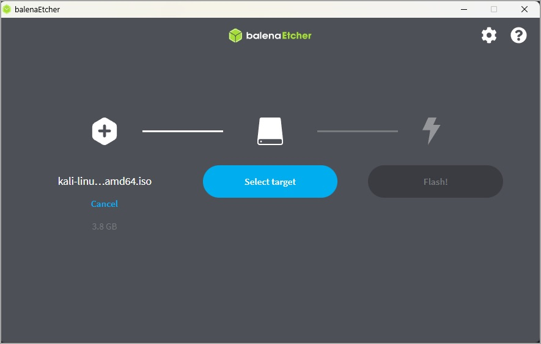

</Steps>

## 2. lépés: Indítsd el a LeafSDTools eszközt, és exportáld a beállításokat az SD-kártyára

Miután a LeafSDTools az SD-kártyára került, mentsd ki vele a beállításfájlt a navigációs fejegységből.

### Belépés a szoftverfrissítési menübe

<Steps>

1. Indítsd el az autót. Miután a navigációs fejegység teljesen elindult, a **MAP** gombbal válts térképnézetre.

2. A bal alsó sarokban található bekapcsológombbal kapcsold ki a hangot.

3. Nyomd meg háromszor a **MAP** gombot, kétszer a média be-/kikapcsoló gombját, végül még egyszer a **MAP** gombot. Ha sikerült, az alábbi képernyő jelenik meg:

   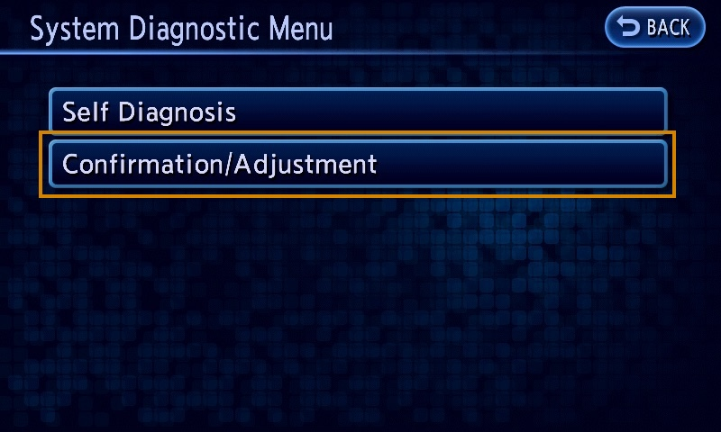

4. Nyisd meg a **Confirmation/Adjustment** menüt, majd görgess a **Software Update** ponthoz.

   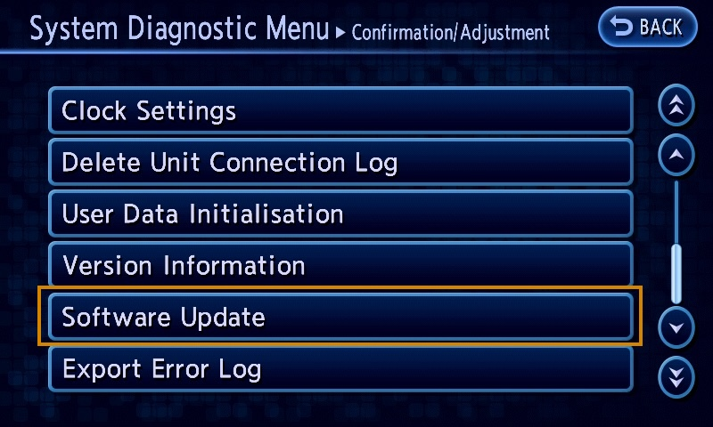

5. Indítsd el a frissítési folyamatot. A fejegységnek újra kell indulnia.

   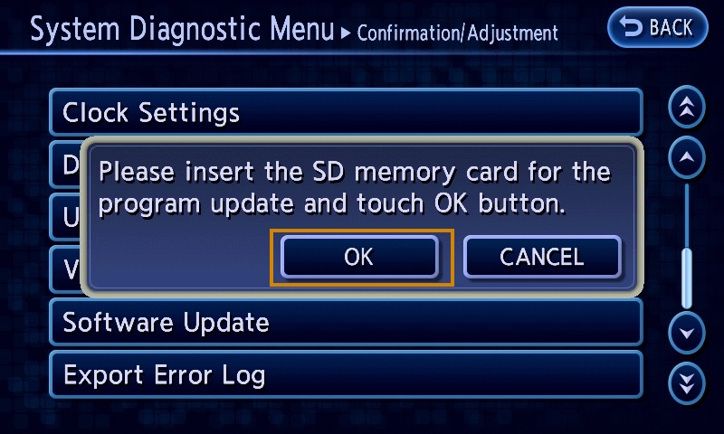

6. Amikor megjelenik a YES/NO párbeszédablak, kapcsold ki az autót, vedd ki az SD-kártyát a **MAP (B) foglalatból**, és helyezd be a saját, LeafSDTools rendszert tartalmazó SD-kártyádat.

   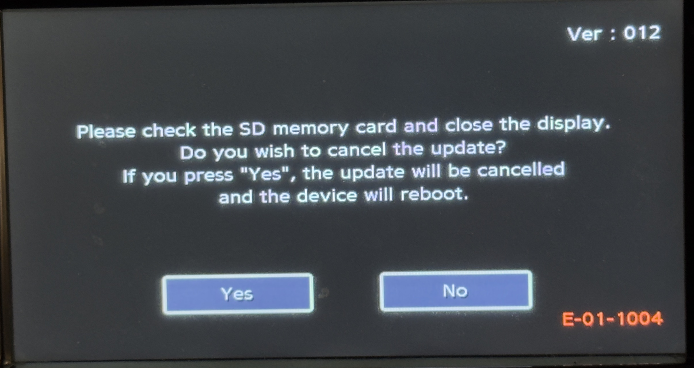

</Steps>

### A beállítások mentése az SD-kártyára

<Steps>

1. Kapcsold be az autót úgy, hogy a LeafSDTools SD-kártyája a MAP B foglalatban van. Néhány másodperc múlva elindul a LeafSDTools. Nyomd meg az **SRAM** menüpontot.

   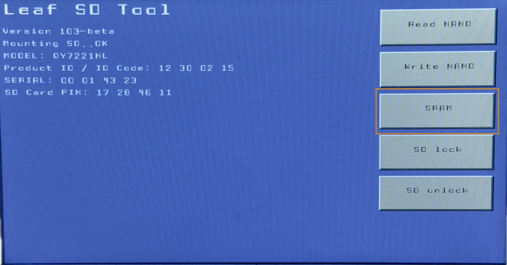

2. Nyomd meg a **Dump to SD** gombot, és várd meg a folyamat befejezését.

   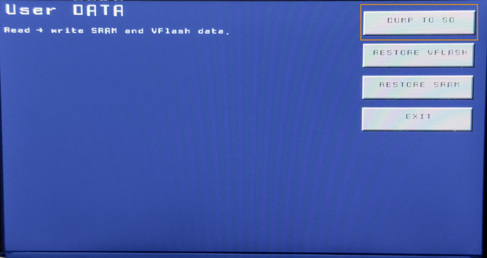

   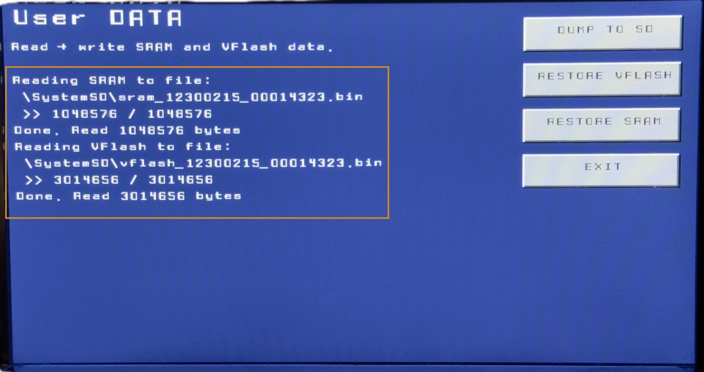

3. Sikeres mentés után lépj ki a menüből, kapcsold ki az autót, majd vedd ki az SD-kártyát a navigációs fejegységből. A fájlt ezután számítógépen szerkesztheted.

</Steps>

## 3. lépés: Módosítsd a navigációs fejegység beállításait

Miután az SD-kártyát csatlakoztattad a számítógéphez, egy ehhez hasonló nevű fájlnak kell megjelennie:

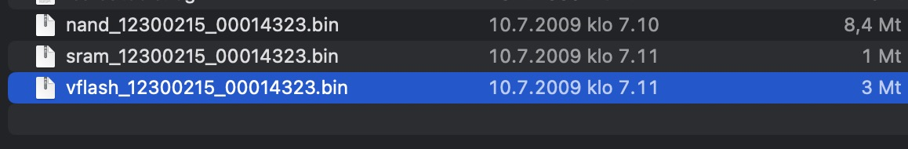

<Aside type="note">
  Ha a fájl nem található, az exportálás valamiért nem sikerült. Ismételd meg a 2. lépést.
</Aside>

Ha a fájl megvan, módosítsd benne az APN-beállításokat:

<Steps>

1. Másold ki a `vflash_xxxxxxxx_xxxxxxxx.bin` fájlt az SD-kártyáról egy másik helyre, például az Asztal vagy a Dokumentumok mappába.

2. Nyisd meg böngészőben a [https://opencarwings.viaaq.eu/navi](https://opencarwings.viaaq.eu/navi) oldalt.

3. Válaszd ki a számítógépről a `vflash_xxxxxxxx_xxxxxxxx.bin` fájlt. A mezőknek ki kell töltődniük, és meg kell jelennie a **Connection Profile 1** profilnak. Ha ez nem történik meg, lépj kapcsolatba a fejlesztővel.

   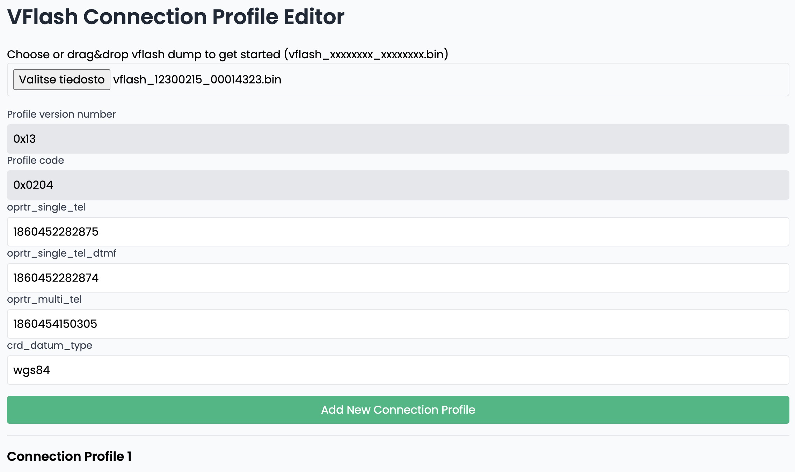

4. Nevezd el a kapcsolati profilt a mobilszolgáltatód alapján.

   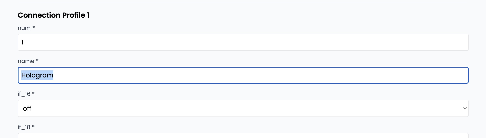

5. Írd át az APN nevét az `apn [cws]` mezőben. A SIM-szolgáltatótól függően szükség lehet az APN-felhasználónév és -jelszó módosítására is a `usr [cws]` és `psswrd [cws]` mezőkben.

   

   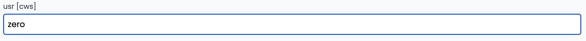

   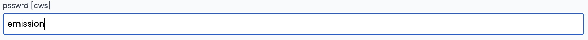

6. Módosítsd a szerver URL-jét a `url [cws]` mezőben.

   ```text title="Szerver URL"
   Eredeti: http://biz.nissan-gev.com/WARCondelivbas/it-m_gw10/
   Új:      http://biz.viaaq.eu/WARCondelivbas/it-m_gw10/
   ```

   Eredeti:

   ![Az eredeti Nissan URL az url [cws] mezőben](../../../../../assets/navi-dual-sd/img15.jpg)

   Módosítva:

   ![A módosított URL az url [cws] mezőben](../../../../../assets/navi-dual-sd/img16.jpg)

7. Görgess az oldal aljára, és kattints az **Export** gombra. Ekkor letöltődik egy új beállításfájl. Másold az SD-kártyára, és erősítsd meg a felülírást, ha a rendszer rákérdez.

   

</Steps>

<Aside type="danger" title="Őrizd meg az eredeti fájlt">
  Az új beállításfájl nevének pontosan meg kell egyeznie az eredetiével. A módosítatlanul kimentett eredeti fájlról külön biztonsági másolatot is őrizz meg.
</Aside>

## 4. lépés: Írd vissza az új beállításokat a navigációs fejegységbe

Másold a módosított beállításfájlt az SD-kártyára, menj vissza az autóhoz, helyezd a kártyát a B foglalatba, majd indítsd el az autót.

<Steps>

1. A LeafSDTools elindulása után válaszd az **SRAM** lehetőséget.

   

2. Nyomd meg a **RESTORE VFlash** gombot, és várd meg a folyamat befejezését.

   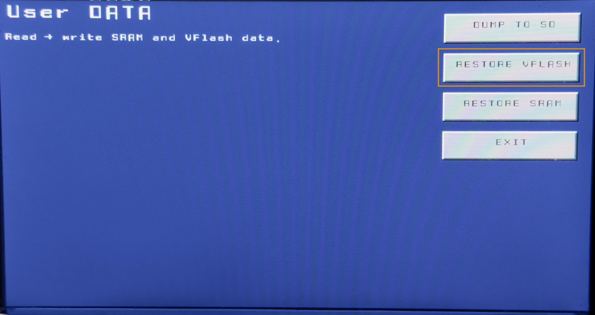

   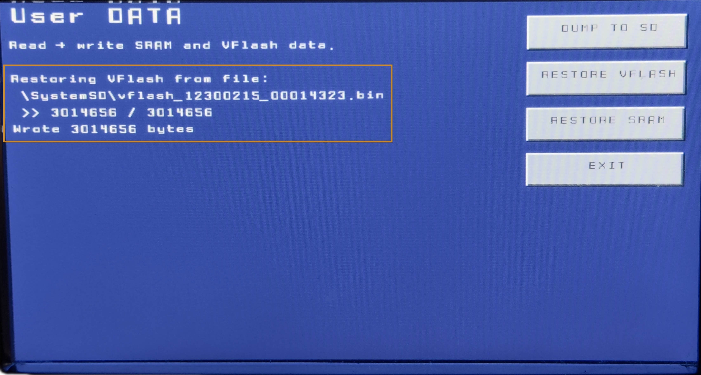

3. A visszaállítás befejezése után az **EXIT** gombbal térj vissza a főmenübe, majd kapcsold ki az autót.

   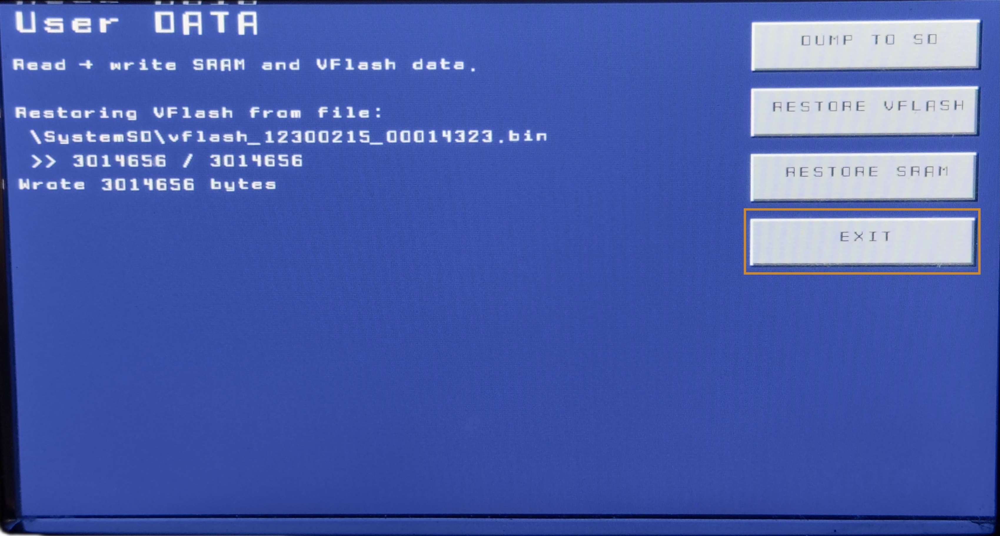

4. Döntsd meg a képernyőt, vedd ki a LeafSDTools SD-kártyáját a B foglalatból, majd helyezd vissza a navigációs fejegység eredeti SD-kártyáját a B foglalatba, és kapcsold be az autót. Megjelenik az alábbi üzenet. Nyomd meg a **Yes** gombot a szoftverfrissítési menüből való kilépéshez.

   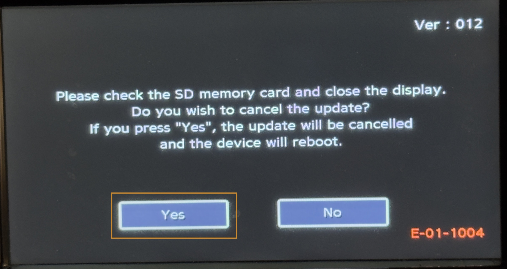

5. Miután a navigációs fejegység visszaállt a normál rendszerébe, ellenőrizd, hogy az új kapcsolati beállításokat alkalmazta-e. Nyomd meg a jobb oldali fizikai **MENU** gombot, majd a képernyőn válaszd a **SETTINGS** lehetőséget. A beállításokon belül nyisd meg a **Phone, CARWINGS**, majd a **Data Transfer Setup** menüt. Sikeres beállítás esetén itt megjelenik a kapcsolati profilod.

   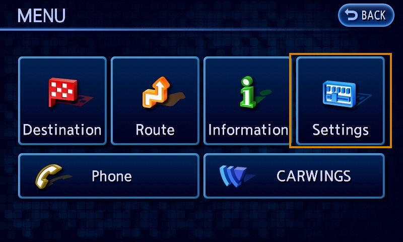

   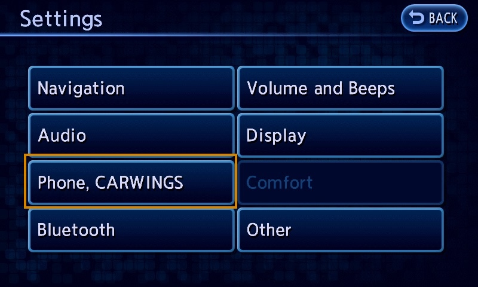

   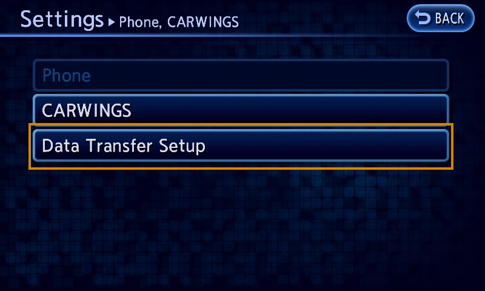

   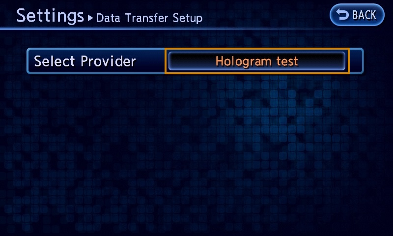

</Steps>

## 5. lépés: Hitelesítsd a hozzáférést a CARWINGS menüben

Utolsó lépésként jelentkezz be a felhasználóneveddel és az OpenCARWINGS szolgáltatásban létrehozott TCU-jelszóval.

<Steps>

1. Nyomd meg a **Zero Emission** gombot, majd válaszd a **CARWINGS** lehetőséget.

   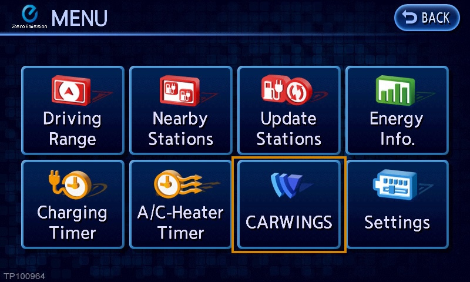

2. Nyomd meg a **Sign In** vagy a **Security Settings** lehetőséget.

   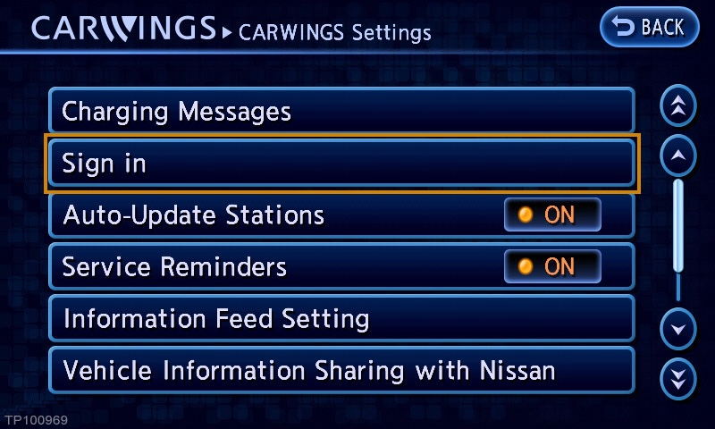

3. Írd be a felhasználónevedet és a TCU-jelszavadat.

   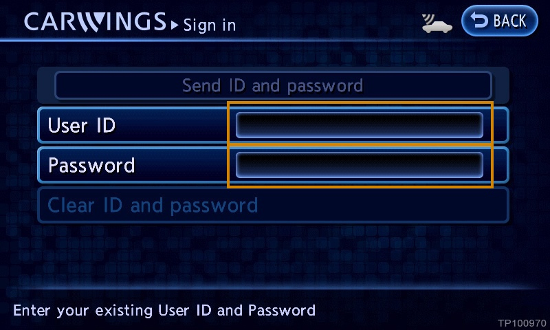

4. Nyomd meg a **Send security settings** vagy a **Send ID and password** gombot. Ha megjelenik a „Security settings activated” üzenet, a bejelentkezés sikerült, és a CARWINGS-szolgáltatások használatra készek.

   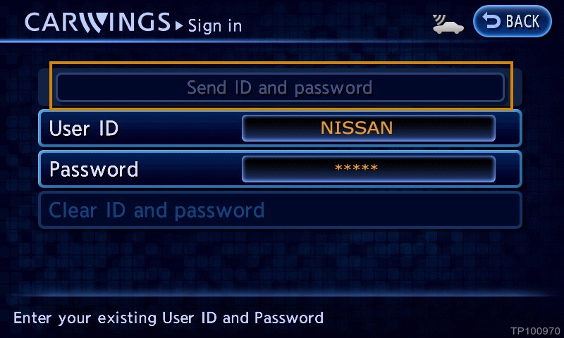

</Steps>

<Aside type="tip" title="Gratulálunk!">
  Ha minden lépés sikerült, a navigációs fejegység ismét eléri a hálózati szolgáltatásokat. Ismét működhet például a célpont autóba küldése, a telemetria és több más funkció. A tényleges működést funkciónként ellenőrizd az autóban.
</Aside>
